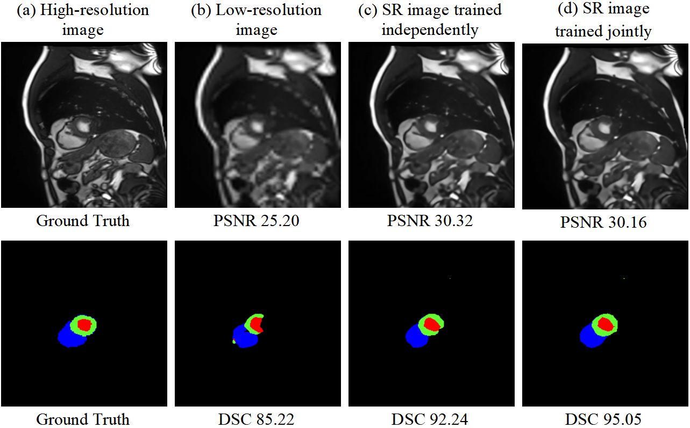
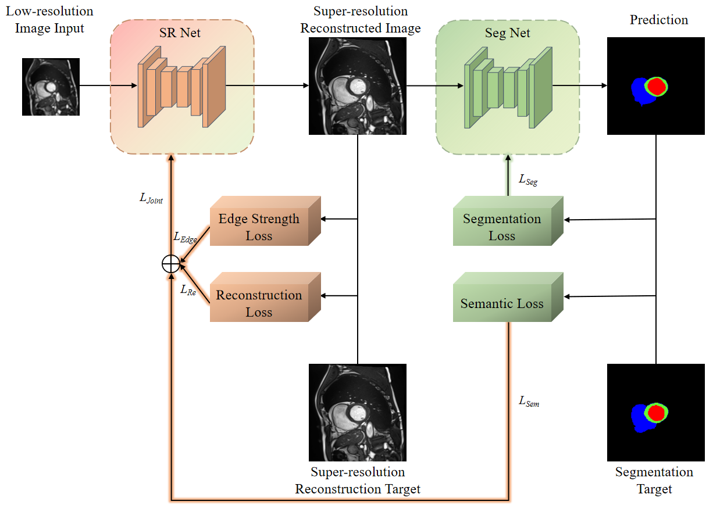

# JOANet
JOANet: An Integrated Joint Optimization Architecture Making Medical Image Segmentation Really Helped by Super-resolution Pre-processing
## Overview
Conventional computer vision pipelines typically treat low-level enhancement and high-level semantic tasks as isolated processes, focusing on optimizing enhancement for perceptual quality rather than computational utility, neglecting semantic task requirements. To bridge this gap, this paper proposes an integrated joint optimization architecture that aligns the objectives of enhancement tasks with the practical needs of semantic tasks. Specifically, the architecture ensures that medical image segmentation (the semantic task) benefits directly from super-resolution pre-processing (the enhancement task). This integrated architecture fundamentally differs from conventional sequential frameworks by enabling joint training of super-resolution and segmentation networks. Guided by its own content reconstruction loss and semantic loss transferred from segmentation, the super-resolution network prioritizes semantically significant regions for segmentation-driven reconstruction.

*Figure 1: A higher PSNR value in an input image does not guarantee improved segmentation results. (a) Original high-resolution image and its standard segmentation annotation. (b) Segmentation result of the low-resolution image. (c) Segmentation result of the super-resolution (SR) image reconstructed by a network trained independently. (d) Segmentation result of the super-resolution image reconstructed by a network trained using the joint training framework.*

*Figure 2: Composition of loss functions in JOANet.*

